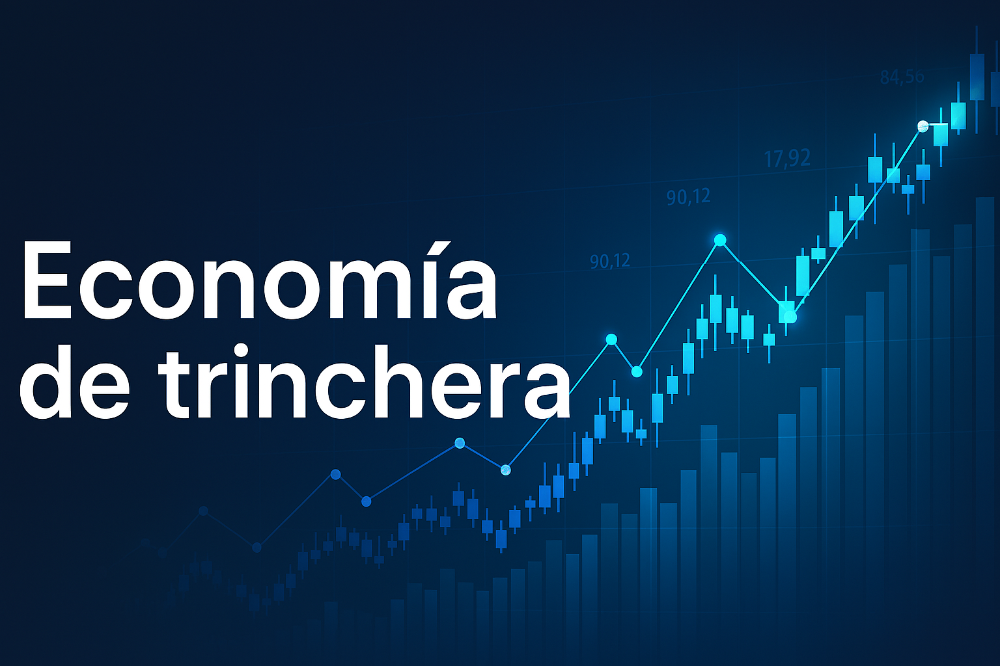

# Economía de Trinchera

{ .hero }

Bienvenido a este espacio donde intento entender la economía desde el barro, sin filtros y sin corbata.  
No es un manual, ni un curso, ni un sitio para aprender fórmulas.  
Es un cuaderno personal donde recojo ideas, reflexiones, herramientas y experiencias que me ayudan a pensar mejor.

Aquí encontrarás tres grandes bloques:

## Ideas
Pensamientos sueltos, intuiciones y conceptos que quiero explorar.  
Algunas son simples notas; otras, como **Contabilidad 3**, están más desarrolladas.

→ [Ir a Ideas](ideas/index.md)

## Programas
Herramientas, scripts y utilidades que uso para organizar mis números, mis experimentos y mis análisis.  
No es un repositorio técnico: es mi caja de herramientas personal.

→ [Ir a Programas](programas/index.md)

## Inversión
Reflexiones y aprendizajes sobre cómo invertir sin complicarse, sin sufrir y sin dejarse engañar por productos innecesariamente complejos.  
Todo desde la trinchera, sin tecnicismos.

→ [Ir a Inversión](inversion/index.md)

## Artículos destacados

-   :material-lightbulb-on: **Contabilidad 3.0**  
    Una nueva forma de entender la contabilidad.  
    [:octicons-arrow-right-24: Leer](ideas/contabilidad3/index.md)

-   :material-chart-line: **Planificación de inversión**  
    Cómo pensar la inversión sin humo.  
    [:octicons-arrow-right-24: Leer](inversion/PlanificacionInversionYGestionRiesgo.md)

---

Este sitio está vivo.  
Irá creciendo a medida que yo también vaya entendiendo (o intentando entender) un poco mejor cómo funciona todo esto.
